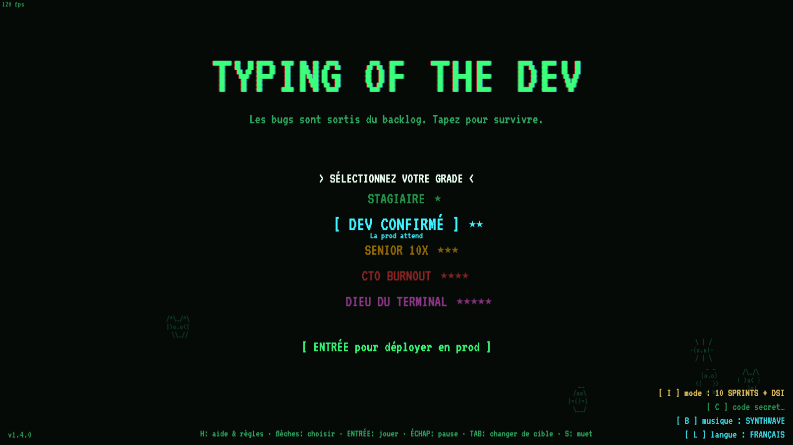
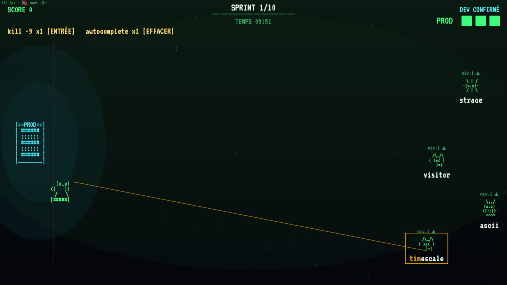

# TYPING OF THE DEV 🧟⌨️

[](public/js/main.js)
[](#requirements)
[](https://phaser.io)
[](package.json)
[](LICENSE)

A booth/arcade typing game and a tribute to *The Typing of the Dead*: zombie
bugs crawl out of the backlog and march toward your PROD server. Type their
words to squash them before the incident. French & English UI, 100% offline,
zero npm dependencies.





## Requirements

- **Node.js ≥ 22.5** — the only real prerequisite: the server uses the native
  `node:sqlite` module (no install step). Check with `node --version`.
- A modern browser (Chrome, Firefox, Edge, Safari) with WebGL for the best
  rendering — Canvas works as a fallback.
- A keyboard 🙂. The game is 100% keyboard-driven and works offline:
  Phaser, the font and all sounds are local or procedurally generated.

## Build & run

There is **nothing to build or install** — no bundler, no `npm install`,
no transpilation. The frontend is plain ES2022 JavaScript loaded by script
tags, Phaser is vendored in `public/lib/`.

```bash
git clone git@github.com:stephanecot/typing-of-the-dev.git
cd typing-of-the-dev
node server.js
# Game        → http://localhost:3333
# Leaderboard → http://localhost:3333/leaderboard.html   (second screen, auto-refresh)
# Admin       → http://localhost:3333/admin.html         (stats, exports, game settings)
```

`PORT=8080 node server.js` to change the port. The SQLite database is created
automatically in `db/` on first launch (and is git-ignored — it may contain
personal data).

### Project layout

```
server.js            zero-dependency Node server: static files + JSON API + SQLite
public/
  index.html         game page (+ GDPR save form as DOM overlay)
  admin.html         dashboard: stats, CSV/JSON exports, game settings
  leaderboard.html   fullscreen top-10 for a second screen
  js/main.js         globals: difficulties, palette, modes, version
  js/data/           word banks, ASCII sprites, FR/EN translations
  js/scenes/         Phaser scenes: Boot, Menu, Game, GameOver
  js/audio.js        procedural WebAudio: SFX + 5 music tracks
db/                  SQLite database (created at runtime, git-ignored)
```

## Gameplay

- Type the **first letter** of an enemy to lock it, finish its word to kill it
  (spaces inside words are optional — typing the next letter skips them).
- **Goal: survive 10 sprints** (configurable from the admin page) then beat the
  final boss, **THE FURIOUS CIO**. A countdown is displayed: every second left
  at victory pays a score bonus.
- **Endless mode** (`I` key on the menu, persisted): no timer, no sprint limit —
  waves keep coming as long as you survive, and 10 exclusive bosses rotate
  every 4 sprints (THE MAINFRAME, TECHNICAL DEBT, THE VENGEFUL INTERN,
  THE SALESMAN, THE BURNING DATACENTER, THE ENDLESS MEETING, THE FRAMEWORK OF
  THE DAY, THE EXPIRED CERTIFICATE, THE SURPRISE AUDIT, THE CLOUD BILL — each
  with its own dirty trick, see the in-game help).
- 3 incidents (enemies reaching PROD) → **PROD IS DOWN** (and the server
  visibly burns).
- A **boss** every 4 sprints: chain several full terminal commands.
- **Enemy powers**: some words come **MINIFIED** (letters masked with `?`) or
  **FLIPPED** (rendered upside down); **THE RECRUITER** spams InMail missiles.
- **Combo**: no typo = a growing score multiplier. Points = word length × 10 ×
  level × combo × **speed bonus** (fast typing pays up to ×3).
- **Ultimate super combo** (difficulties ★★★ and up): combo milestones 5/10/15
  grant +1/+2/+3 **combat stars** (max 6, kept when the combo breaks). Powers —
  typing always has priority, the key only fires when the letter is not a valid
  keystroke: `A` 3 s shield (1★) · `Z` +1 life (3★) · `E` smite the strongest
  enemy, bosses excluded (2★).
- **Items**: `ENTER` → KILL -9 (kills the process closest to prod, max 3) ·
  `BACKSPACE` → AUTOCOMPLETE (the AI types the next 4 letters, max 5).
- **Golden power-ups**: `coffee` (slow-mo), `git revert` (knockback),
  `sudo reboot` (screen purge).
- `H` on the menu: full help (rules, difficulties, bestiary with spawn rates,
  bosses, release notes — pages scroll with ↑/↓). `L`: French/English.
  `B`: cycle the 5 music tracks. `S`: mute.

### Enemies (17 kinds — full bestiary in-game)

From lvl.1 swarm bugs and already-misspelled TYPOs to lvl.5 nightmares: the
RANSOMWARE re-encrypts its word every 6 s and the INSPIRED PO makes other
enemies' words grow. Some split (virus, microservice), some dodge (the
freelancer), some hide everything behind a smoke screen (the obfuscator).

### Difficulties

| | INTERN | MID-LEVEL DEV | SENIOR 10X | CTO BURNOUT | TERMINAL GOD |
|---|---|---|---|---|---|
| Speed | ×0.62 | ×1.0 | ×1.35 | ×1.7 | ×2.1 |
| Lives | 4 | 3 | 2 | 2 | **1** |
| Score multiplier | ×1 | ×1.5 | ×2 | ×3 | ×4 |
| Boss commands | 2 | 3 | 4 | 5 | 6 |

Lvl.4 enemies appear from CTO BURNOUT up, lvl.5 only at TERMINAL GOD.

### Secret codes

Press `C` on the home screen to open the secret code prompt (typing a code
again disables it):

| Code | Effect |
|---|---|
| `gines` | every word becomes a geeky insult |
| `disco` | mirror ball, dance floor, sweeping spotlights… and disco music |
| `boisson` | the screen sways like one drink too many |
| `speed` | everything moves 30% faster, all difficulties |
| `iddqd` or Konami (↑↑↓↓←→←→BA) | god mode — invincible but flagged CHEATER, score not saved |

## Database & exports

SQLite in `db/typing-of-the-dev.sqlite` (created on first launch). Each game
stores: nickname, first/last name/email/phone *(optional, kept only when the
GDPR consent box is checked)*, difficulty, score, sprints, WPM, accuracy, max
combo, duration, kills per enemy class and missed words.

Exports from `/admin.html`:
- `/api/export.csv` — all games (`;`-separated CSV with Excel BOM)
- `/api/export.json` — same as JSON
- `/api/export-emails.csv` — only contacts who opted in (GDPR)

The admin page also shows fun end-of-day stats: average WPM, total bugs
squashed, **the wall of shame** (most missed words), and lets you set the
number of sprints needed to face the final boss.

## Stack

- [Phaser 3.87](https://phaser.io), vendored in `public/lib/` (offline)
- VT323 font, CRT look (scanlines/vignette/flicker in CSS — disabled with
  `prefers-reduced-motion`)
- 100% procedural WebAudio: SFX + 5 selectable generative music tracks
  (MATRIX, SYNTHWAVE, LOUNGE, RAVE, 8-BIT HERO), intensity follows the waves
- `node:http` + `node:sqlite` server — zero npm dependency
- Accessibility: WCAG AA contrasts, reduced-motion support, color-blind-safe
  enemy design (shape + badge redundancy), no `{ } [ ]` in typed words

## License

[MIT](LICENSE)
